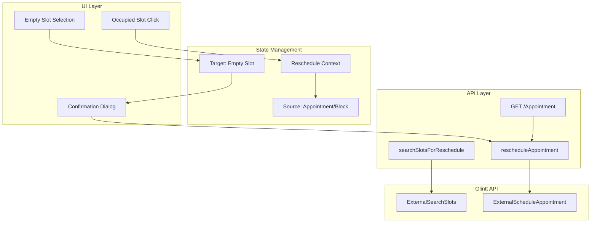

1# Implement Reschedule Logic for Main App

## Problem Statement

When rescheduling an appointment into an aggregated empty block (e.g., 14:00-16:00 = 4 x 30min slots), we must:

1. Place the appointment at the START of the empty block
2. Only occupy the time needed (e.g., 1 hour appointment uses 2 x 30min slots)
3. Keep remaining time visibly free (e.g., 15:00-16:00 stays empty)
4. For conciliated blocks (multiple appointments for same patient), move the entire block together

## Architecture Overview




## Implementation Steps

### Phase 1: API Functions in glintt-api.ts

Add two new functions to [`frontend/src/lib/glintt-api.ts`](frontend/src/lib/glintt-api.ts):**1.1 `searchSlotsForReschedule()`** - Search available slots with reschedule context

- Set `RescheduleFlag: true`
- Include `episode: { EpisodeType: "Consultas", EpisodeID: appointmentId }`
- Returns individual slot units (30min granularity)

**1.2 `rescheduleAppointment()`** - Execute the reschedule

- Set `RescheduleFlag: true` and `Episode` with the appointment ID
- For conciliated blocks: call sequentially for each appointment in the block, incrementing the target slot time

### Phase 2: API Route

Create new route [`frontend/src/app/api/glintt/reschedule/route.ts`](frontend/src/app/api/glintt/reschedule/route.ts):

```typescript
// POST /api/glintt/reschedule
// Body: { 
//   appointments: [{ appointmentId, patientId, durationMinutes }],
//   targetSlotDateTime: string,
//   doctorCode: string,
//   serviceCode: string
// }
```

The route handles:

1. Validate target slot has enough space
2. For each appointment in the block, calculate its new slot time
3. Call `rescheduleAppointment()` for each
4. Return success/failure

### Phase 3: Reschedule Context and State

Create [`frontend/src/contexts/reschedule-context.tsx`](frontend/src/contexts/reschedule-context.tsx):

```typescript
interface RescheduleState {
  isActive: boolean;
  sourceBlock: ConciliatedBlock | null;  // The appointment(s) being moved
  targetSlot: ScheduleSlot | null;       // The empty slot selected
}
```

Key logic in context:

- `startReschedule(block)` - Activates reschedule mode, stores source
- `selectTargetSlot(slot)` - Validates slot has enough space for block duration
- `executeReschedule()` - Calls API and refreshes schedule
- `cancelReschedule()` - Resets state

### Phase 4: UI Integration

**4.1 Modify slot click behavior in schedule view:**

- Occupied slot click: Show "Reschedule" button in details
- When reschedule mode active: Empty slots become selectable targets
- Visual indicator showing which slots can fit the appointment

**4.2 Slot validation logic:**

```typescript
// In appointment-utils.ts
function canFitAppointment(
  emptySlot: ScheduleSlot,      // The merged empty block
  appointmentDuration: number   // Minutes needed
): boolean {
  return (emptySlot.durationMinutes || 0) >= appointmentDuration;
}
```

**4.3 Confirmation dialog:**

- Show source appointment details
- Show target slot time
- Show what will remain empty after reschedule
- Confirm/Cancel buttons

### Phase 5: Duration Handling for Conciliated Blocks

Update [`frontend/src/lib/glintt-api.ts`](frontend/src/lib/glintt-api.ts) `buildConciliatedBlocks()`:The existing function already calculates `durationMinutes` for blocks. We need to use this when:

1. Displaying the reschedule source (e.g., "Moving 1 hour block")
2. Validating target slots can fit the block
3. Calculating how many individual reschedule calls to make

**Reschedule execution for a 1-hour block (2 x 30min appointments):**

```javascript
Target: 14:00 (empty block 14:00-16:00)
Appointment A (30min) → reschedule to 14:00
Appointment B (30min) → reschedule to 14:30
Result: 14:00-15:00 occupied, 15:00-16:00 remains free
```


### Phase 6: Post-Reschedule Refresh

After successful reschedule:

1. Call `loadSchedule()` to refresh the view
2. Glintt will return updated slot states:

- Former empty slots now show as "S" (occupied)
- Remaining slots still show as "N" (free)

3. The existing merge logic in `appointment-utils.ts` will correctly aggregate remaining empty time

## Key Files to Modify/Create

| File | Action |
|------|--------|
| [`frontend/src/lib/glintt-api.ts`](frontend/src/lib/glintt-api.ts) | Add `searchSlotsForReschedule()`, `rescheduleAppointment()` |
| [`frontend/src/app/api/glintt/reschedule/route.ts`](frontend/src/app/api/glintt/reschedule/route.ts) | Create new API route |
| [`frontend/src/contexts/reschedule-context.tsx`](frontend/src/contexts/reschedule-context.tsx) | Create reschedule state management |
| [`frontend/src/lib/appointment-utils.ts`](frontend/src/lib/appointment-utils.ts) | Add `canFitAppointment()` helper |
| Schedule view component | Add reschedule button, target selection mode |

## Testing Approach

1. Test with single appointment reschedule
2. Test with conciliated block (2+ appointments)


